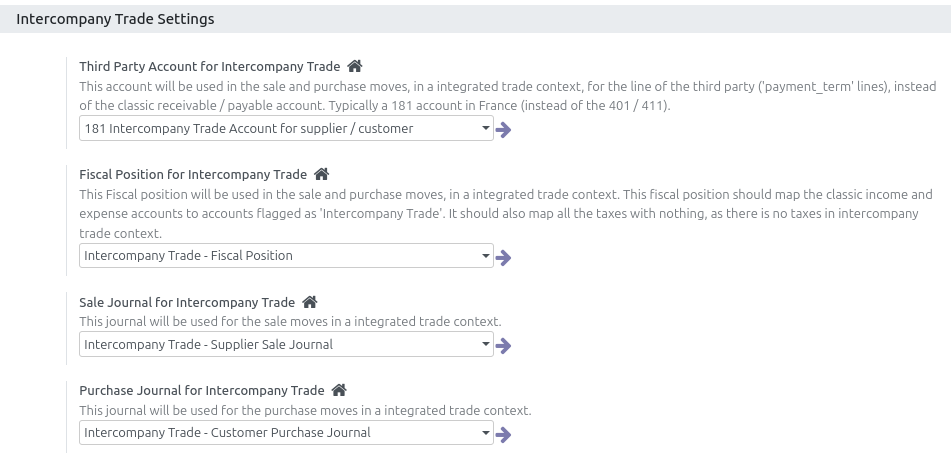

* Go to "Accounting > Configuration > Settings"

* At the end of the setting part, you can configure the accouting
  configuration related to Intercompany trades.

Note that you can only select items flagged as 'Intercompany Trade' here.

